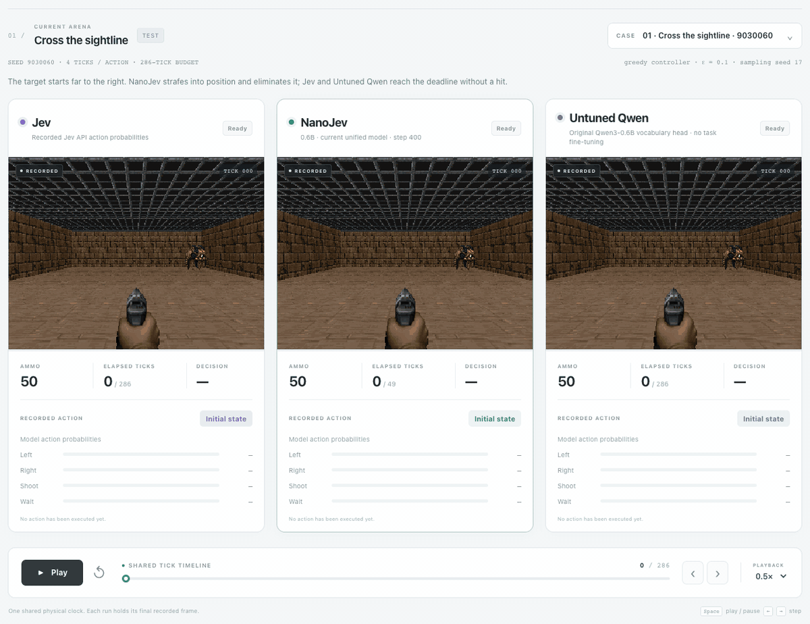
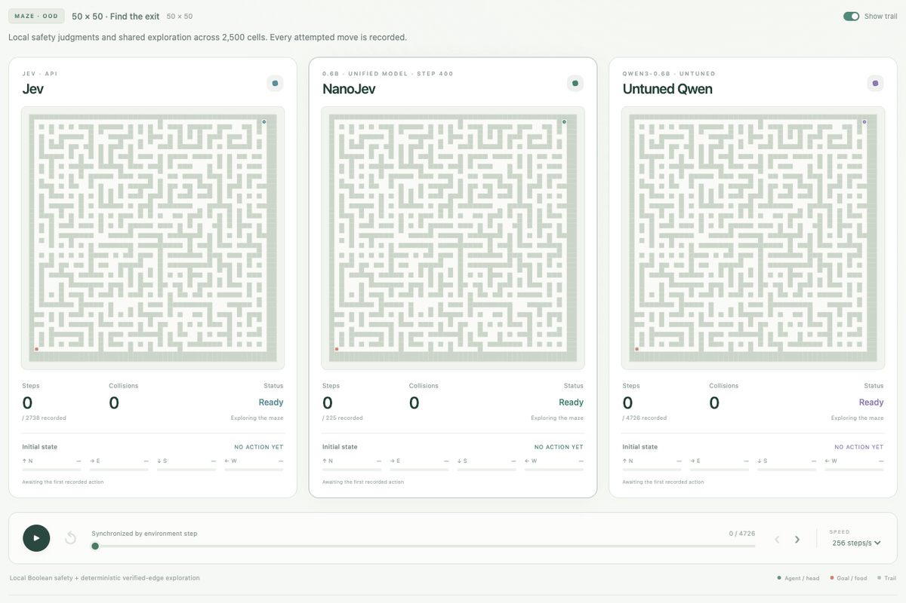

# NanoJev — A nano replica of [Jev](https://typesafe.ai/blog/introducing-system-one-models-and-jev)

**简体中文** | [English](README.md)

**一个 0.6B 并行决策模型：输入状态与问题，直接得到完整概率分布，无需生成答案 token。**

> **新项目：[JevHarness](https://github.com/TianyuCodings/JevHarness)** — 让 LLM 围绕 [Jev](https://typesafe.ai/blog/introducing-system-one-models-and-jev) 编写面向具体任务的决策程序，并可利用奖励与执行轨迹进一步优化。附有可交互的 Pokémon 演示。

[体验 ViZDoom](https://nanojev-dev.tianyuchen99.chatgpt.site/?autoplay=1) · [Maze 与 Snake](https://nanojev-dev.tianyuchen99.chatgpt.site/side-by-side?autoplay=1#maze) · [模型](https://huggingface.co/C-Tianyu/NanoJev) · [数据集](https://huggingface.co/datasets/C-Tianyu/NanoJev-Data)

**现在支持 ViZDoom：** 同一个 checkpoint 完成 Basic 的瞄准射击、Predict Position 的移动目标火箭射击，同时支持 Maze 和 Snake。

**4 项任务 · 每种数据版本 18,760 条决策问题 · 896 局 Predict Position 专家轨迹**

## 更新内容

**2026 年 9 月 20 日：一个模型，四款游戏。**

- **ViZDoom Basic：** 测试成功 **128/128**，对比 [Jev](https://typesafe.ai/blog/introducing-system-one-models-and-jev) 的 **56/128**。
- **ViZDoom Predict Position：** 测试成功数从本轮训练前的 **11/128** 提升至 **27/128**；同条件 [Jev](https://typesafe.ai/blog/introducing-system-one-models-and-jev) 为 **11/128**。策略学习何时转向、等待并向移动目标发射火箭。
- **16,333 条 ViZDoom 问题：** 每种目标版本共 **18,760 条**混合任务问题，覆盖 train、dev、calibration、test 和 OOD 五个分区。
- **一个模型，四款游戏：** 同一个 step-400 checkpoint 用 **225 次行动**完成 50×50 迷宫，并在完整存活 256 步的 Snake 对局中吃到 **30 个食物**。

## 三个模型，并排回放

**[Jev](https://typesafe.ai/blog/introducing-system-one-models-and-jev)、NanoJev 和未微调 Qwen** 的真实网页回放。下方动图自动循环，点击即可进入交互播放器。四款演示使用同一个当前 NanoJev checkpoint。交互开发站目前需要访问权限；也可按下方命令在本地播放所有录制案例。

### ViZDoom Basic · 瞄准，再开火

[](https://nanojev-dev.tianyuchen99.chatgpt.site/?autoplay=1)

移动到位，对准目标，再开火。NanoJev 在 **1.40 秒内一枪消灭目标**；[Jev](https://typesafe.ai/blog/introducing-system-one-models-and-jev) 和未微调 Qwen 各开 **19 枪**，直到时限结束仍未消灭目标。三栏按同一游戏时钟同步播放，展示原始画面与动作概率。

### 找到出口 · 50×50 Maze

[](https://nanojev-dev.tianyuchen99.chatgpt.site/side-by-side?autoplay=1#maze)

NanoJev 用 **225 次行动**到达出口，[Jev](https://typesafe.ai/blog/introducing-system-one-models-and-jev) 用 **2,738 次**，未微调 Qwen 用 **4,726 次**。三组都通过局部安全概率驱动相同探索代码，并记住已经走通的路径。

[打开 Snake](https://nanojev-dev.tianyuchen99.chatgpt.site/side-by-side?autoplay=1#snake) · [打开 Predict Position](https://nanojev-dev.tianyuchen99.chatgpt.site/predict-position?autoplay=1)

## 核心能力

- **并行决策：** 将独立状态、问题和候选路径放入同一次 backbone 前向计算。
- **动态候选：** Choice 通过共享评分头，返回所提供的 2–255 个候选的完整分布。
- **布尔与等级问题：** 输出一个命题成立的概率，或 2–10 个有序等级的分布及期望。
- **直接输出概率：** 可用于排序、贪心选择或采样，无需生成答案 token。
- **轻量统一底座：** Qwen3-0.6B 加决策头，支持四款游戏及持久推理服务。

每个请求包含**状态、问题和候选集合**。模型编码候选路径，再由共享决策头输出概率。Choice 使用集合注意力与 softmax，Boolean 使用 sigmoid，Score 返回等级的概率加权期望。

## 完整测试结果

以下为 **274 个测试案例**的成功数。各系统使用相同观察接口、候选动作和固定随机种子的 epsilon-greedy 控制器：

| 模型 | Maze | Snake | Basic | Predict Position |
|---|---:|---:|---:|---:|
| **NanoJev** | **4/10** | **8/8** | **128/128** | **27/128** |
| [Jev](https://typesafe.ai/blog/introducing-system-one-models-and-jev) | 7/10 | 8/8 | 56/128 | 11/128 |
| 未微调 Qwen3-0.6B | 2/10 | 0/8 | 56/128 | 11/128 |

测试与 OOD 合计为**每个模型 548 个案例**，全部评测轨迹均通过独立模拟器重放。上方大规模导航演示使用页面标明的局部问题与代码规划设置。

[完整测试及 OOD 结果](docs/SONIC_PREDICT_POSITION_RESULTS.md) · [训练流程](docs/SONIC_PREDICT_POSITION.md)

## 数据规模与模型

**每种目标版本包含 18,760 条决策问题，其中 16,333 条来自 ViZDoom。** hard-target 与 soft-target 两种版本覆盖相同问题，均划分为 train、dev、calibration、test 和 OOD 五个分区。

| 任务 | 五个分区合计 | 训练分区 |
|---|---:|---:|
| **ViZDoom Predict Position** | **11,173** | **6,788** |
| **ViZDoom Basic** | **5,160** | **3,054** |
| Maze | 1,469 | 653 |
| Snake | 958 | 403 |
| **每种版本合计** | **18,760** | **10,898** |

**专家游戏轨迹：** 数据包包含 **896 局 Predict Position、17,498 个决策步骤**，其中 512 局分配给训练。还包括原始混合任务输入、hard/soft 目标、评测轨迹和重放检查记录。

训练分区保存的 10,898 条问题中，**10,893 条**通过目标有效性检查。原有 Maze、Snake 和 Basic 分区保持一致。

### 发布版本与训练实验

**`unified-games-v1` 打包的是 `hard_lr1e5` 训练实验的第 400 步 checkpoint。** 两个名称对应同一份选定模型，四款演示均使用该模型。

| 名称 | 含义 | 使用场景 |
|---|---|---|
| **`unified-games-v1`** | Hugging Face 发布标签，固定对应的模型与数据快照。 | 下载时填写 `revision="unified-games-v1"`。 |
| **`hard_lr1e5`** | 训练实验名：Predict Position 使用 one-hot 硬动作目标，backbone 学习率为 `1e-5`，决策头学习率为 `1e-4`。 | 查看训练配置、日志与实验对比。 |

共享模型使用完整问题交叉熵训练。每次更新按 **1/3、1/3、1/6、1/6** 的权重混合 Maze、Snake、Basic 和 Predict Position。

**Hugging Face 发布完成：** 模型与完整数据均已上传并通过校验，版本为 `unified-games-v1`。两个发布标签均固定到对应快照，所有上传文件均通过远端内容校验。

模型与数据集均为公开版本，无需登录即可下载。

## 快速开始

```bash
git clone https://github.com/TianyuCodings/NanoJev.git
cd NanoJev
python -m pip install -r requirements-toy.txt huggingface_hub
```

下载当前 checkpoint 与数据：

```python
from huggingface_hub import snapshot_download

snapshot_download(
    repo_id="C-Tianyu/NanoJev",
    revision="unified-games-v1",
    local_dir="checkpoints/NanoJev-unified",
    allow_patterns=["best.safetensors", "config.json", "tokenizer/*", "backbone_config/*"],
)
snapshot_download(
    repo_id="C-Tianyu/NanoJev-Data",
    repo_type="dataset",
    revision="unified-games-v1",
    local_dir="data/NanoJev-unified",
)
```

在 CUDA 环境启动推理服务：

```bash
python scripts/serve_decisions.py \
  --checkpoint-dir checkpoints/NanoJev-unified \
  --web-root web --port 8765 --disable-native-triton
```

模型只加载一次。向 **`POST http://127.0.0.1:8765/api/evaluate`** 发送状态与问题批次即可调用。

本地体验真实游戏回放：

```bash
python3 -m http.server 8080 --bind 127.0.0.1 --directory web
```

打开 **http://127.0.0.1:8080/dev/?autoplay=1** 体验 ViZDoom Basic，或打开 **http://127.0.0.1:8080/dev/side-by-side.html?autoplay=1#maze** 体验迷宫。

## 开发文档

[发布内容与复现方法](docs/UNIFIED_DEVELOPMENT_RELEASE.md) · [输入契约](docs/TYPESAFE_CONTRACT.md) · [统一环境](docs/UNIFIED_GAMES.md) · [原子判断与规划](docs/ATOMIC_PLANNING.md) · [Predict Position 回放](docs/PREDICT_POSITION_DEMO.md) · [射击回放](docs/SHOOTING_DEMO.md)

## 路线图

- [x] 一个统一 checkpoint 支持 Maze、Snake 和两款射击任务。
- [x] 50×50 迷宫、长局 Snake 与三模型同步网页回放。
- [x] 混合任务 SFT、可复现的数据划分与独立重放评测。
- [ ] 面向更多长程任务的 RLCD 后训练。
- [ ] 共享前缀推理与更大的候选批次。
- [ ] 更多射击场景与结构化输入支持。
