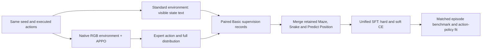

# APPO expert action supervision

This experiment improves the unified NanoJev action policy on ViZDoom Basic using a public, pretrained APPO policy. The same model continues to handle Maze, Snake and Predict Position. The experiment protocol is fixed in [`appo_basic_supervision_v1.json`](../configs/appo_basic_supervision_v1.json).

The primary hard-target model reaches **128/128 Basic test successes**, up from **56/128** for the original unified SFT checkpoint. With eight-tick actions, it reaches **126/128**, up from **59/128**. All three training arms and their closed-loop evaluations are complete.



## Data pipeline

1. Load the pinned `edbeeching/doom_basic_1111` checkpoint, including its observation normalization and recurrent memory.
2. Start two Basic environments with the same episode seed. The expert receives its original 160×120 HUD-on pixels. NanoJev receives the existing 320×240 HUD-off visible-state text.
3. Advance both games with the same action, one physical tick at a time. Check player variables, game clock, reward and terminal flags after every tick. Replay the complete trajectory in a third, standard environment to verify the student observations independently.
4. Save the expert's full action distribution and its argmax before applying exploration. Execute the fixed greedy policy with epsilon 0.1. The action used as the hard label is the expert argmax; the actual exploration action is recorded separately.
5. Retain every visited decision state and every complete episode, including failures. Generate hard and soft target views with identical state IDs, questions and candidate sets.

The question and dynamic candidate-scoring architecture are unchanged. Candidate scores become a categorical action distribution through softmax. Hard action supervision uses `-log p(expert_action | state, question, candidates)`. The soft comparison uses `-sum_a p_expert(a) log p_model(a)` at temperature one. These are action-policy targets.

The completed collection contains **896 successful episodes and 5,160 decisions**. Eight CPU workers collected and verified 20,469 physical ticks in 91.7 seconds. All hard and soft records match their original trajectories; 409 executed actions differ from the expert argmax and retain the separate expert label.

| Split | Episodes | Expert decisions |
| --- | ---: | ---: |
| Train | 512 | 3,054 |
| Development | 64 | 384 |
| Calibration | 64 | 377 |
| Test | 128 | 756 |
| OOD, eight-tick actions | 128 | 589 |

## Unified training

All arms start from the selected original unified SFT checkpoint, SHA256 `c5b2f41459c9ccabe7417a2947489eaa80443935bc79d3cb528a886aab58d3d5`, with a fresh optimizer. Only Basic data is replaced. Every original Maze, Snake and Predict Position record is copied verbatim with its existing split and labels.

Each task keeps one third of the total loss weight. Within shooting, Basic and Predict Position keep the original effective-example ratio, 453:517. Increasing the Basic corpus therefore does not reduce the other tasks' loss weights.

| Arm | Basic target | Training seed | Updates |
| --- | --- | ---: | ---: |
| Frozen SFT | No parameter updates | — | 0 |
| Hard SFT | Expert argmax | 17 | 300 |
| Soft SFT | Full expert action distribution | 17 | 300 |
| Hard SFT repeat | Expert argmax | 29 | 300 |

The two seed-17 arms use the same sampled question sequence. Training uses batch size 24, up to eight questions per microbatch, an 8,192-token input limit, BF16, gradient checkpointing, backbone learning rate `2e-5`, head learning rate `2e-4`, and weight decay `0.01`. Select the checkpoint using fixed pool-weighted development CE, including the initial checkpoint as a candidate.

## Benchmark

New Basic episode seeds are frozen before collection: 512 train, 64 development, 64 calibration, 128 test and 128 OOD. The OOD condition executes each action for eight ticks; the other splits use four. Both respect the original native game deadline and first observed kill as success.

Compare the frozen SFT model, all trained arms, the APPO expert and uniform random actions on the same new test/OOD cases. Report success counts, Wilson confidence intervals, paired differences, physical game ticks, ammunition use and native reward. Existing Maze, Snake and Predict Position test/OOD cases provide a separate regression benchmark with their original controller. Previous Basic cases remain a historical comparison cohort.

Action-label CE and calibration measure agreement with the expert action targets. Winning probability requires separate observed-outcome evaluation.

Basic uses a finite set of initial positions. The 128 test episodes include 100 initial inputs that match a training initial input and 28 that do not. A supplementary [frozen input-overlap analysis](../configs/appo_basic_supervision_v1_novelty.json) reports both groups while retaining every case in the main benchmark. Membership uses initial state text and questions; the longer action interval also changes the OOD input text.

## Results

### Closed-loop Basic

Each model plays all 128 cases in each split. APPO and all NanoJev checkpoints use greedy selection with epsilon 0.1 and sampling seed 17; the random baseline samples uniformly. The primary model is the predeclared hard-target seed-17 arm. All checkpoints were selected at update 300 using development loss.

| Policy | Test, four-tick actions | OOD, eight-tick actions | Test mean ticks | Test mean ammo used |
| --- | ---: | ---: | ---: | ---: |
| Original unified SFT | 56/128 (43.8%) | 59/128 (46.1%) | 187.89 | 13.45 |
| **NanoJev, hard targets, seed 17** | **128/128 (100%)** | **126/128 (98.4%)** | **22.31** | **1.12** |
| NanoJev, soft targets, seed 17 | 128/128 (100%) | 127/128 (99.2%) | 32.92 | 1.95 |
| NanoJev, hard targets, seed 29 | 128/128 (100%) | 128/128 (100%) | 30.24 | 1.83 |
| APPO expert | 128/128 (100%) | 128/128 (100%) | 20.78 | 1.11 |
| Uniform random | 76/128 (59.4%) | 61/128 (47.7%) | 171.52 | 6.95 |

The primary model improves success by 56.25 percentage points on test and 52.34 points on OOD. Its test success Wilson 95% interval is 97.1–100%; its OOD interval is 94.5–99.6%. Mean ticks and ammunition include every episode, including failures. The one- or two-episode differences among trained arms are small relative to this cohort's uncertainty.

All trained arms solve **28/28 test cases whose initial input does not occur among the training initial inputs**, compared with 12/28 for the original checkpoint. The other 100 test cases are also all solved by each trained arm. See the [complete episode report](../results/appo_basic_supervision_v1/summary.md) and [initial-input groups](../results/appo_basic_supervision_v1/initial_overlap_summary.json).

### Action distribution fit

The same 756 expert-visited test states are used for every model. Metrics below use the common expert argmax and full expert probabilities, regardless of the model's training objective.

| Model | Expert argmax agreement | Hard-label NLL | Expert-to-model KL | Action-label ECE, 15 bins |
| --- | ---: | ---: | ---: | ---: |
| Original unified SFT | 26.98% | 2.6650 | 2.4982 | 0.6567 |
| Hard targets, seed 17 | 81.61% | 0.6120 | 0.5058 | 0.1296 |
| Soft targets, seed 17 | 77.12% | 0.5274 | 0.3730 | 0.0621 |
| Hard targets, seed 29 | 82.14% | 0.6014 | 0.4797 | 0.1083 |

Soft targets provide the closest probability fit, while hard targets give the highest action agreement in this comparison. The full [action-fit report](../results/appo_basic_supervision_v1/action_fit/summary.md) also includes calibration and OOD splits. These probabilities describe the expert's choice of action.

### Retained-task regression

The original test and OOD cases are evaluated separately using their unchanged controller and then totalled below. These are the unified action-policy cases; the composed maze demo has its own code planner and benchmark.

| Model | Maze, 20 episodes | Snake, 16 episodes | Predict Position, 12 episodes |
| --- | ---: | ---: | ---: |
| Original unified SFT | 6/20 | 9/16 | 1/12 |
| Hard targets, seed 17 | 6/20 | 9/16 | 1/12 |
| Soft targets, seed 17 | 4/20 | 8/16 | 1/12 |
| Hard targets, seed 29 | 6/20 | 10/16 | 1/12 |

The primary hard-target model retains all three aggregate counts. Its Snake test result rises from 4/8 to 5/8 while OOD falls from 5/8 to 4/8. The soft arm loses two Maze successes and one Snake success in aggregate. Predict Position keeps its existing supervision and remains a separate target for improvement. See the [per-split regression report](../results/appo_basic_supervision_v1/regression/summary.md).

All 21 scheduled jobs finished successfully. Independent environment replays verified all 1,472 new student/baseline evaluation episodes with zero mismatches, in addition to the 896 expert collection replays. The [training audit](../results/appo_basic_supervision_v1/validation/training_audit.json) records initialization, selected checkpoints and identical seed-17 training batches.

## Reproduce

Use the pinned Sample Factory source and verified APPO model from the [APPO evaluation setup](APPO_BASIC_RESULTS.md). No new API calls are needed.

```bash
python scripts/collect_appo_parallel.py \
  --cases configs/appo_basic_supervision_v1_cases.jsonl \
  --config configs/appo_basic_supervision_v1.json \
  --model-dir /path/to/doom_basic_1111 \
  --output data/appo_basic_supervision_v1/expert --workers 8

python scripts/audit_appo_supervision_data.py \
  --episodes data/appo_basic_supervision_v1/expert/episodes.jsonl \
  --output data/appo_basic_supervision_v1/data_diagnostic.json

python scripts/prepare_appo_supervision.py \
  --original data/unified_v2/policy_full \
  --expert data/appo_basic_supervision_v1/expert \
  --output data/appo_basic_supervision_v1/unified

python scripts/run_appo_supervision.py \
  --datasets data/appo_basic_supervision_v1/unified \
  --init-checkpoint /path/to/original_sft_bundle \
  --output runs/appo_basic_supervision_v1 \
  --gpus 0,1,2,3

python scripts/summarize_appo_supervision.py \
  --run frozen_sft=runs/appo_basic_supervision_v1/frozen_sft_fresh.jsonl \
  --run hard_s17=runs/appo_basic_supervision_v1/hard_s17_fresh.jsonl \
  --run soft_s17=runs/appo_basic_supervision_v1/soft_s17_fresh.jsonl \
  --run hard_s29=runs/appo_basic_supervision_v1/hard_s29_fresh.jsonl \
  --run appo_1111=data/appo_basic_supervision_v1/expert/episodes.jsonl \
  --run random=runs/appo_basic_supervision_v1/random_fresh.jsonl \
  --output-dir results/appo_basic_supervision_v1
```

Collection, training and evaluation write local artifacts with hashes and manifests. The scripts do not publish checkpoints or datasets.
