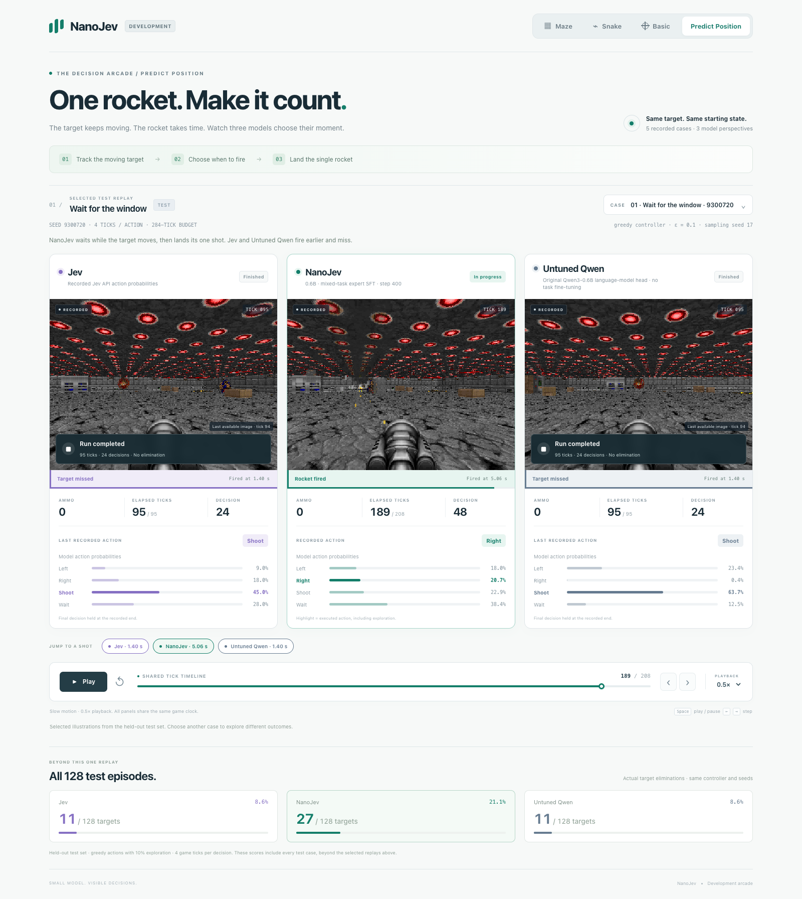

# Predict Position: one rocket, three policies

[Open the Predict Position replay](https://nanojev-dev.tianyuchen99.chatgpt.site/predict-position.html).

The light development viewer shows **Jev, NanoJev and Untuned Qwen** playing
the same moving-target scenario. Maze, Snake and Basic now use this same unified
step-400 checkpoint in the [development arcade](SHOOTING_DEMO.md). Watch the original game frames, action
probabilities, actual rocket launch times and final outcomes on one shared
physical clock. Playback starts paused at **0.5× speed**; play, seek, step one
tick or jump directly to any model's shot. The **Play the NanoJev win** button
returns to the featured NanoJev-only success and starts playback.



[Download the comparison video](../assets/predict_position.mp4).

## Featured recording

In seed **9300720**, NanoJev waits as the target moves and fires later:

| Policy | Actual launch | End of episode | Outcome |
|---|---:|---:|---|
| Jev | Tick 49 · 1.40 s | Tick 95 · 2.71 s | Miss |
| NanoJev | Tick 177 · 5.06 s | Tick 208 · 5.94 s | Hit |
| Untuned Qwen | Tick 49 · 1.40 s | Tick 95 · 2.71 s | Miss |

Times are elapsed game ticks divided by 35. The game consumes the one rocket
at the actual launch tick. Selecting the `shoot` action may precede launch due
to the native weapon animation. The shot buttons use observed ammunition
decreases.

The case picker contains two selected NanoJev wins: **Wait for the window**
(seed 9300720) and **Turn into the shot** (seed 9300738). Jev and Untuned Qwen
miss in both. Each comparison resets all models to the same seed and uses its
complete recorded trajectory. The score strip below still covers all 128 test
episodes.

## Complete test cohort

The score strip summarizes all 128 held-out Predict Position test episodes:

| Policy | Targets eliminated |
|---|---:|
| NanoJev | 27/128 · 21.1% |
| Jev | 11/128 · 8.6% |
| Untuned Qwen | 11/128 · 8.6% |

All policies use the same structured observation interface, candidate actions,
four-tick action cadence and epsilon-greedy controller (epsilon 0.1, seed 17).
NanoJev uses the dev-selected mixed expert SFT checkpoint, `hard_lr1e5` step 400.
Untuned Qwen uses its original Qwen3-0.6B weights and vocabulary head.

[Full mixed-task test and OOD results](SONIC_PREDICT_POSITION_RESULTS.md).

## Reproduction

The exporter replays the saved decisions on CPU, verifies every environment
transition against its source, captures real RGB frames and checks each
lossless WebP atlas after decoding. Final frames freeze at each model's actual
terminal tick. A frame unavailable at termination retains its original
`image_tick` in the data and viewer.

```bash
python scripts/build_predict_position_demo.py \
  --output web/dev \
  --receipt results/predict_position_demo_v1/build_manifest.json

python3 -m http.server 8093 --bind 127.0.0.1 --directory web
```

Open `http://127.0.0.1:8093/dev/predict-position.html`. Source paths default to
the locally retained mixed-SFT experiment. Use a fresh output index and receipt
when exporting. `--validate-only` verifies the complete source cohort and case
selection without rendering.

`scripts/check_predict_position_demo.mjs` verifies playback, shot events,
benchmark counts, original canvas pixels and mobile layout. The deterministic
video exporter, `scripts/capture_predict_position_demo.mjs`, records the
complete default case on the same shared timeline. Both accept local Chrome
and Playwright paths; the video exporter additionally accepts FFmpeg.

The [media receipt](../results/predict_position_demo_v1/build_manifest.json)
records source files, checkpoint identity, runtime and asset hashes. The
[current two-win selection receipt](../results/predict_position_wins_v2/filter_manifest.json)
verifies that the retained frames and image pixels are unchanged. The separate
development hosting bundle contains the viewer and recorded media.
