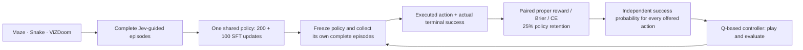

# One checkpoint for Maze, Snake, and ViZDoom

This pipeline trains one shared NanoJev checkpoint to answer dynamic action
Choice questions and action-conditioned Boolean outcome questions across three
games. It predicts probabilities directly; it does not generate action text.
Each loss-control run contains one complete shared model for all three tasks.
Training warm-starts from an existing NanoJev checkpoint.

The cycle is:

**Jev episodes → policy SFT → freeze the resulting behavior policy → complete
episodes → observed-outcome training plus policy retention → Q-based control
→ collect fresh episodes under the new frozen controller.**



The post-training stage uses **RLCD-inspired paired proper-reward learning**.
Its `paired_brier_pg` objective supplies a Monte Carlo gradient estimator for
the expected Brier objective, with direct Brier and observed CE controls.
This explicit objective is not a recovered TypeSafe training recipe.
See the [official primer](https://docs.typesafe.ai/introduction/machine-learning-primer)
and the repository's [objective specification](RLCD_EXPERIMENT.md).

## Environment contract

Each adapter implements `reset(seed) -> (observation, info)`,
`step(action_id) -> (observation, reward, terminated, truncated, info)`, and
`close()`. The JSON observation contains `task`, `state`, `candidates`,
`remaining_steps`, and `step`. The policy receives only the text state and
offered action descriptions. Evaluation information is not appended to that
input. Terminal states offer no candidates; single-candidate decisions execute
without fabricating a multi-class Choice training example.

| Task | What the model sees and controls | Success and time accounting |
| --- | --- | --- |
| Maze | A **5×5 local window**, current position and goal, recent physical events, and the **complete observed edge graph** in compact row masks. Only untried directions are offered, including directions that may collide. | Reach the goal before the physical-attempt deadline. When no untried direction remains locally, code can reposition along previously traversed open edges. Every reposition move consumes the same budget and is logged separately. |
| Snake | Full current body, heading, current food, remaining budget, and recent events. Every non-reverse direction is offered, including fatal moves. No food RNG or future food positions enter the input. | Collect the specified number of additional food items after reset before the attempt deadline. Collision is failure; merely surviving the deadline is not success. |
| Shooting | ViZDoom `basic` or `predict_position`, visible label bounding boxes, player health/ammo/pose, and at most four recent observed frames. Four actions: left, right, shoot, noop. Basic uses strafing; predict_position uses turning. | A positive `KILLCOUNT` delta defines success, independently of reward. Native timeout, death, scripted termination without a kill, and the declared task deadline are terminal failures. |

The shooting adapter uses synchronous headless `PLAYER` mode. It holds each
chosen action for up to `frame_skip` physical Doom ticks, stopping at the first
goal/terminal tick. Internal one-tick advances preserve the kill counter before
a scripted map exit can reset the native clock. `max_steps` counts model
decisions; optional `max_ticks` further limits controlled physical ticks. The
last action is shortened to the remaining deadline. Native rewards, kills,
damage, ammo use, and actual ticks are recorded separately. The policy uses **visible object labels**; pixel encoding
is a separate future extension. Full objects, sectors, and automap information
are disabled.

All configured deadlines are part of the tasks, so they produce
`terminated=True`, `truncated=False`. The collector rejects external truncation
as an outcome label rather than calling an unfinished episode a failure.

The frozen curriculum in [the case file](../configs/unified_games_v1_cases.jsonl)
contains 228 episodes: Maze 8×8, 16×16, and 50×50; Snake 8×8, 10×10, and
12×12; and both shooting scenarios. Maze uses a 5×5 local observation window.
Every case records its exact topology, deadline, Snake target, and shooting
frame skip. Results are reported separately for each environment variant.
The completed Jev-guided collection has **16,637 executed decisions**:
14,503 have model action answers and 2,134 are forced singleton moves. The
base collection contains 192 episodes and the extension 36. These counts are
collection sizes, not a model-quality claim or a count of network API calls.

## What the probability target means

For the presented observation/history `h`, an executed action `a`, a frozen
continuation policy `pi_old`, and the remaining task deadline, learn:

```text
Q_pi_old(h, a) = P(task succeeds before its deadline | h, execute a,
                  then follow pi_old)
Y = actual final episode success, either false or true
```

The Choice policy produces one normalized distribution over the current
candidate set. The Q interface asks a separate Boolean question for each
candidate: several actions can each have high success probability, so these
values are **not normalized across actions**. `q_greedy` ranks the independent
true probabilities, then applies the declared exploration rule. The resulting
action distribution is distinct from those Boolean predictions.

Each retained transition gets an outcome question **only for its executed
action**. The final episode outcome supplies `gold`, with
`gold_label_kind='observed_outcome'`. Unexecuted actions receive no imagined
counterfactual labels. No one-step safety rule, action preference distribution,
or bootstrapped estimate substitutes for that completed-episode observation.
Outcome training retains every recorded decision transition, including forced
singleton actions. Internal Maze reposition moves consume the physical budget
and appear in movement logs; they are not separate model decision questions.
Selecting a fixed number of states based on the final episode length would make inclusion depend on
future termination and can bias the success target. Policy SFT may use a
bounded per-episode subset because its targets are supplied state-conditional
API distributions.

The frozen policy identity covers the checkpoint, controller, exploration rate,
sampling seed, and implementation hashes. Collection uses a fixed checkpoint
throughout; training starts only after its episode manifest is finished.
Changing any continuation rule changes the prediction task. A Q-based controller
can choose the highest predicted `Q_pi_old`, but this does **not** make that
prediction calibrated for continuing with the resulting `pi_new`. Freeze the
new controller, collect new complete episodes, and train a new version.

For each Boolean question, `paired_brier_pg` draws `M=32` independent predictive
categories with replacement. These samples are **not physical game actions**:

```text
R = (2/M) sum_i 1[A_i = Y]
    - sum_{i != j} 1[A_i = A_j] / (M * (M - 1))
E[R | Y] = 2 p[Y] - sum_k p[k]^2 = 1 - vector_Brier(p, Y)
```

The detached local credit and conditional baseline implement the score-function
gradient specified in `calibrated_objectives.py`. There is no PPO clipping,
group-standard-deviation normalization, or policy-entropy calibration claim.
Direct Brier is the required control: it optimizes the same expected proper
objective without predictive Monte Carlo sampling. Lower sampled surrogate
loss is not itself a better reported probability score.

## Reproduce the pipeline

Run commands from the repository root in a virtual environment. Install
`requirements-toy.txt` for model training and `requirements-vizdoom.txt` for
shooting. Live Jev collection also requires Node.js with `--env-file` support
and a separately configured, ignored `.env`; no credential values belong in
case files, checkpoints, or reports. `checkpoints/starting` below must contain
the complete DecisionModel bundle, including weights, config, tokenizer, and
backbone config.

```bash
python -m pip install -r requirements-toy.txt -r requirements-vizdoom.txt
python scripts/test_unified_grid_envs.py
python scripts/test_unified_doom_env.py --real
python -m unittest discover -s scripts -p test_unified_training.py -v

python - <<'PY'
import json
from pathlib import Path
rows = [json.loads(line) for line in
        Path("configs/unified_games_v1_cases.jsonl").read_text().splitlines()]
base = {"maze8", "snake8", "doom_basic", "doom_predict_position"}
root = Path("data/unified")
root.mkdir(parents=True, exist_ok=True)
for name, selected in (
    ("base_cases", [r for r in rows if r["variant"] in base]),
    ("extension_cases", [r for r in rows if r["variant"] not in base]),
):
    with (root / f"{name}.jsonl").open("x") as handle:
        for row in selected:
            handle.write(json.dumps(row, sort_keys=True) + "\n")
PY

python scripts/unified_game_pipeline.py rollout \
  --cases data/unified/base_cases.jsonl --engine jev \
  --controller greedy --epsilon 0.10 --seed 17 --env-batch 4 \
  --env-file .env --journal-dir research/private_unified_jev \
  --budget-usd 2 --output data/unified/jev_base.jsonl

python scripts/unified_game_pipeline.py dataset \
  --episodes data/unified/jev_base.jsonl --role policy \
  --journal-dir research/private_unified_jev \
  --max-states-per-episode 24 --output data/unified/policy_base

python scripts/unified_game_pipeline.py rollout \
  --cases data/unified/extension_cases.jsonl --engine jev \
  --controller greedy --epsilon 0.10 --seed 17 --env-batch 4 \
  --env-file .env --journal-dir research/private_unified_jev_extension \
  --budget-usd 2 --output data/unified/jev_extension.jsonl
python scripts/unified_game_pipeline.py dataset \
  --episodes data/unified/jev_extension.jsonl --role policy \
  --journal-dir research/private_unified_jev_extension \
  --retention data/unified/policy_base --max-states-per-episode 24 \
  --output data/unified/policy_full

python scripts/train_unified_games.py --input data/unified/policy_base \
  --stage sft --validate-only
CUDA_VISIBLE_DEVICES=0 python scripts/train_unified_games.py \
  --input data/unified/policy_base --init-checkpoint checkpoints/starting \
  --output-dir runs/sft_base --stage sft --loss ce \
  --steps 200 --eval-every 50 --batch-questions 12 \
  --microbatch-questions 4 --max-length 8192 \
  --backbone-lr 2e-5 --head-lr 2e-4 --gradient-checkpointing \
  --precision bf16 --seed 17 --disable-native-triton
CUDA_VISIBLE_DEVICES=0 python scripts/train_unified_games.py \
  --input data/unified/policy_full --init-checkpoint runs/sft_base \
  --output-dir runs/sft_unified --stage sft --loss ce \
  --steps 100 --eval-every 100 --batch-questions 24 \
  --microbatch-questions 8 --max-microbatch-tokens 32768 --max-length 8192 \
  --backbone-lr 2e-5 --head-lr 2e-4 --gradient-checkpointing \
  --precision bf16 --seed 17 --disable-native-triton

CUDA_VISIBLE_DEVICES=0 python scripts/unified_game_pipeline.py rollout \
  --cases configs/unified_games_v1_cases.jsonl --engine checkpoint \
  --checkpoint runs/sft_unified --controller sample --epsilon 0.15 \
  --seed 17 --env-batch 4 --max-length 8192 \
  --output data/unified/frozen_sft_episodes.jsonl

python scripts/unified_game_pipeline.py dataset \
  --episodes data/unified/frozen_sft_episodes.jsonl --role outcome \
  --retention data/unified/policy_full --max-states-per-episode 0 \
  --output data/unified/outcomes_v1
python scripts/train_unified_games.py --input data/unified/outcomes_v1 \
  --stage critic --validate-only

for loss in paired_brier_pg brier ce; do
  CUDA_VISIBLE_DEVICES=0 python scripts/train_unified_games.py \
    --input data/unified/outcomes_v1 --init-checkpoint runs/sft_unified \
    --output-dir "runs/critic_${loss}_v1" --stage critic --loss "$loss" \
    --reward-samples 32 --balance task --retention-fraction 0.25 \
    --steps 200 --eval-every 200 --batch-questions 24 \
    --microbatch-questions 8 --max-microbatch-tokens 32768 --max-length 8192 \
    --backbone-lr 2e-5 --head-lr 2e-4 --gradient-checkpointing \
    --precision bf16 --seed 17 --disable-native-triton
done
```

These are the prototype schedules: 200 base SFT updates, 100 additional SFT
updates on the full curriculum, and 200 updates for each outcome-loss control.
Each stage loads the preceding selected `best.safetensors` with a fresh optimizer;
the second SFT stage is not an uninterrupted optimizer continuation. Update
counts do not imply measured performance. Use fresh output paths; completed
collections and runs are not overwritten. The tracked case file fixes the
228-episode curriculum; the optional `cases` subcommand generates a new smaller
base curriculum rather than reproducing that full frozen file. API collection
must be rerun to obtain new live answers, which need not be byte-identical.
Policy targets require matching successful API receipts for the
same state/question; malformed or ineligible targets are not repaired silently.

SFT gives equal population weight to the three tasks. Critic training also
balances tasks and assigns 25% total loss weight to retained policy CE and
75% to observed-outcome loss. Every effective update contains the required
task/role cells, with weights correcting integer batch allocations. The direct
Brier and CE controls use the same starting weights, data, seed, update count,
and retention schedule. `--max-states-per-episode 0` is mandatory for outcome
datasets; the builder rejects a nonzero cap to avoid future-length selection
bias. Token limits reject oversized inputs rather than silently
removing observed graph memory; increase the limit and budget explicitly for
larger maps.

Run all three loss controls on the same frozen cases with the same Q-controller
settings. This executes new trajectories on all 228 cases and also creates
fresh continuation-policy data for the next iteration:

```bash
for loss in paired_brier_pg brier ce; do
  CUDA_VISIBLE_DEVICES=0 python scripts/unified_game_pipeline.py rollout \
    --cases configs/unified_games_v1_cases.jsonl --engine checkpoint \
    --checkpoint "runs/critic_${loss}_v1" \
    --controller q_greedy --epsilon 0.15 --seed 17 \
    --env-batch 16 --batch-questions 16 --max-length 8192 \
    --output "data/q_${loss}_v1_episodes.jsonl"
done
```

Here `q_greedy` means greedy ranking before the declared 15% uniform exploration
mixture. For the earlier `sample` controller, the mixture is
`0.85 * Choice_probability + 0.15 / candidate_count`. Both rules, including
their randomness, belong to their frozen continuation-policy identities.
Report test and OOD completion separately; collecting all splits does not
permit their records to enter the training sampler.

Evaluate the SFT checkpoint's outcome predictions on the same frozen dataset
before comparing it with the three trained critics:

```bash
CUDA_VISIBLE_DEVICES=0 python scripts/evaluate_unified_checkpoint.py \
  --input data/unified/outcomes_v1 --checkpoint runs/sft_unified \
  --output-dir runs/eval_sft_outcomes --stage critic \
  --microbatch-questions 8 --max-microbatch-tokens 32768 --max-length 8192 \
  --precision bf16 --disable-native-triton
```

This command evaluates a supplied checkpoint without parameter updates or
temperature fitting. Here `--stage critic` only chooses the metric weights.
Use its outcome-only metrics for a before/after probability comparison.
Compare game performance before and after outcome training under the same
action-selection rule:

```bash
CUDA_VISIBLE_DEVICES=0 python scripts/unified_game_pipeline.py rollout \
  --cases configs/unified_games_v1_cases.jsonl --engine checkpoint \
  --checkpoint runs/sft_unified --controller q_greedy --epsilon 0.15 \
  --seed 17 --env-batch 16 --batch-questions 16 --max-length 8192 \
  --output data/sft_q_baseline.jsonl
```

The first completed cycle selects the paired arm using development CE and
prepares its next iteration dataset after the complete rollout:

```bash
python scripts/unified_game_pipeline.py dataset \
  --episodes data/q_paired_brier_pg_v1_episodes.jsonl --role outcome \
  --retention data/unified/policy_full --max-states-per-episode 0 \
  --output data/unified/outcomes_v2
python scripts/train_unified_games.py --input data/unified/outcomes_v2 \
  --stage critic --validate-only
```

This completes one round of outcome training and controller replacement, with
new data ready for another round. The second round's parameter updates have
not started. To continue, train from the selected paired checkpoint using
`outcomes_v2`. Exploration belongs to the continuation
policy identity. Do not merge old and new outcome-policy IDs as one calibrated
target. Recollection and iteration choices must use training/development
evidence; test and OOD outcomes remain evaluation only.

Replay the recorded actions without model inference and generate a comparison
from complete episode manifests:

```bash
for loss in paired_brier_pg brier ce; do
  python scripts/replay_unified_episodes.py \
    --episodes "data/q_${loss}_v1_episodes.jsonl" \
    --output "data/q_${loss}_v1_replay.json"
done

python scripts/summarize_unified_games.py \
  --run 'Jev=data/unified/jev_base.jsonl' \
  --run 'Jev=data/unified/jev_extension.jsonl' \
  --run 'SFT Q=data/sft_q_baseline.jsonl' \
  --run 'Paired Q=data/q_paired_brier_pg_v1_episodes.jsonl' \
  --run 'Brier Q=data/q_brier_v1_episodes.jsonl' \
  --run 'CE Q=data/q_ce_v1_episodes.jsonl' \
  --training 'SFT Q=runs/eval_sft_outcomes/summary.json' \
  --training 'Paired Q=runs/critic_paired_brier_pg_v1/summary.json' \
  --training 'Brier Q=runs/critic_brier_v1/summary.json' \
  --training 'CE Q=runs/critic_ce_v1/summary.json' \
  --output-dir results/unified_comparison
```

Repeating a run name combines its disjoint case files. The reporter verifies
completion, file hashes, identical case definitions, and checkpoint identities
before comparing systems. It writes task/scenario success, episode counts,
Wilson intervals, and probability metrics to JSON and Markdown.

## Splits, artifacts, and interpretation

Every dataset has `train`, `dev`, `calibration`, `test`, and `ood` JSONL files
plus a manifest. Isolation follows the underlying environment group: Maze uses
canonical map identity, Snake uses the initial simulator snapshot, and shooting
uses scenario plus environment seed. Different latent environments may produce
identical visible observations in a POMDP. Such aliases are allowed; the public
observation hash is recorded separately from episode/decision identity. This
does not permit the same environment group to cross splits. Under aliasing,
the learned probability is conditional on the available observation and the
collection distribution, not knowledge of a hidden full state.

Episode manifests retain source and checkpoint hashes, the continuation ID,
case membership, completion status, and task summaries. Training writes input
hashes, target/token audits, optimizer settings, logs, `best.safetensors`, the
tokenizer/backbone config, and held-out prediction files. Selection uses fixed
task/role-weighted **dev CE**, including the initial checkpoint as a candidate;
test is evaluated after selection. The calibration split does not imply that a
temperature or another post-hoc calibrator has been fitted.

Report policy-distribution matching separately from observed Boolean NLL and
vector Brier, and both separately from live task completion. Binary vector
Brier sums errors for both false and true. Keep failures and zero-success
episodes, report task/role counts and class balance, and account for dependence
between transitions from the same episode when estimating uncertainty. Report each map size and scenario separately, using completed episodes as the
unit of game-success evaluation.
